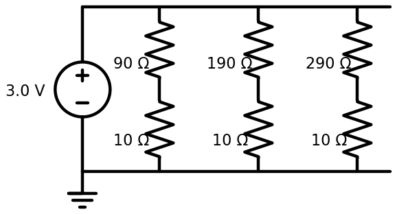
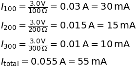

# Parallel Branch Currents

## What This Shows

A parallel circuit gives current more than one path. Each branch touches the same `3.0 V` supply, like two AA batteries in series, but each branch draws its own current depending on that branch's resistance.

## Schematic



## What To Observe

The top wire is a `3.0 V` bus. Each branch connects from that bus down to ground.

There are three branches:

- `90 ohm + 10 ohm = 100 ohm`
- `190 ohm + 10 ohm = 200 ohm`
- `290 ohm + 10 ohm = 300 ohm`

The `10 ohm` resistor at the bottom of each branch is a sense resistor. It is included so a voltage probe can show current indirectly:


Expected sense voltages:

- `100 ohm` branch: about `0.3 V`, or `300 mV`, so current is about `0.03 A`, or `30 mA`
- `200 ohm` branch: about `0.15 V`, or `150 mV`, so current is about `0.015 A`, or `15 mA`
- `300 ohm` branch: about `0.1 V`, or `100 mV`, so current is about `0.01 A`, or `10 mA`

The smallest resistance branch carries the most current.

Each complete branch drops the full `3.0 V` from top to bottom. The current is different because each branch has a different resistance.

## Math



The sense resistor is also just a small voltage divider inside each branch. In the `100 ohm` branch, the `10 ohm` sense resistor is one tenth of the total branch resistance, so it drops about one tenth of the source voltage:


## Q/A

**Q: Why does each branch start at the same voltage?**

A: The top of every branch is connected to the same wire, the `3.0 V` bus. A wire is treated as one shared electrical node, so all points on that bus have nearly the same voltage.

**Q: Which branch carries the most current, and why?**

A: The `100 ohm` branch carries the most current. Ohm's law says `I = V / R`, so with the same `3.0 V`, the lowest resistance branch draws the most current.

**Q: Does adding more parallel branches increase or decrease total current draw?**

A: It increases total current draw. Each new branch adds another path for current, so the source must supply the sum of all branch currents.

**Q: If one branch is removed, do the other branches still have a complete path?**

A: Yes. Each branch has its own path from the `3.0 V` bus to ground, so the other branches can keep working.

**Q: Why might the logger or tooltip show millivolts and milliamps?**

A: Small values are easier to read with metric prefixes. For example, `0.15 V` is the same as `150 mV`, and `0.015 A` is the same as `15 mA`.

## Import Text

```text
$ 1 5.0E-6 10 50 5
# Parallel branch current lesson:
# Each branch has its own path from the 3.0 V bus to ground.
# The lower resistor in each branch is a 10 ohm sense resistor.
v 0 256 0 128 0 0 0 3.0 0
w 0 128 128 128 0
w 128 128 256 128 0
w 256 128 384 128 0
r 128 128 128 192 0 90
r 128 192 128 256 0 10
r 256 128 256 192 0 190
r 256 192 256 256 0 10
r 384 128 384 192 0 290
r 384 192 384 256 0 10
w 0 256 128 256 0
w 128 256 256 256 0
w 256 256 384 256 0
g 0 256 0 256 0
O 128 128 128 64 2
O 128 192 96 192 2
O 256 192 224 192 2
O 384 192 352 192 2
```
