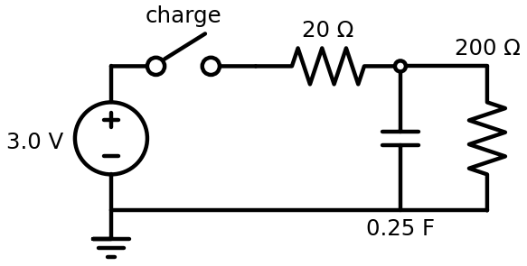

# RC Charging Curve

## What This Shows

A capacitor does not jump instantly to the source voltage. It charges quickly at first, then more slowly as it gets close to full.

## Schematic



## What To Observe

The source is `3.0 V`, like two AA batteries in series. The capacitor is `0.25 F`, or `250 mF`, and the charging resistor is `20 ohm`.

A `200 ohm` discharge resistor is connected across the capacitor. An ideal capacitor can hold charge forever, but real capacitors slowly leak. This resistor makes that leakage path visible and predictable: when the switch opens, the capacitor voltage slowly falls back toward `0 V`.

The time constant is:


At 20 Hz, `4.5 s` is about `90` simulator ticks. The Industrial Data Logger should show the capacitor voltage curving upward toward about `2.7 V`. It does not quite reach `3.0 V` because a small current keeps flowing through the discharge resistor.

After about one time constant, the capacitor should be about `63%` charged:


When the switch opens, the capacitor discharges through the `200 ohm` resistor:


## Q/A

**Q: Why is the curve steepest right after the switch closes?**

A: At first, the capacitor voltage is low, so the resistor has almost the full `3.0 V` across it. That makes the current largest at the beginning.

**Q: Why does the curve flatten as the capacitor fills?**

A: As capacitor voltage rises, the resistor has less voltage across it. Less resistor voltage means less current, so charging slows down.

**Q: Why add a resistor across the capacitor?**

A: It gives the capacitor a controlled discharge path. Without it, the simulator's ideal capacitor would not leak charge on its own, so it could stay charged for a very long time (effectively forever) after the switch opens.

**Q: What would happen if the resistor were larger?**

A: The capacitor would charge more slowly, and the circuit would draw less current from the source.

**Q: What would happen if the capacitor were larger?**

A: It would take more charge to reach the same voltage, so the curve would also be slower.

**Q: Why might the capacitor value be shown as `250 mF`?**

A: `mF` means millifarads. `1000 mF = 1 F`, so `250 mF = 0.25 F`.

## Import Text

```text
$ 1 5.0E-6 10 50 5
# RC charging lesson:
# 3.0 V source charges a 0.25 F capacitor through a 20 ohm resistor.
# A 200 ohm resistor across the capacitor gives it a visible discharge path.
# Charge time constant is about 4.5 s. Discharge time constant is 50 s.
v 0 192 0 128 0 0 0 3.0 0
w 0 128 64 128 0
s 64 128 128 128 0 1
r 128 128 256 128 0 20
c 256 128 256 192 0 0.25 0
w 256 128 320 128 0
r 320 128 320 192 0 200
w 320 192 256 192 0
w 256 192 0 192 0
g 0 192 0 192 0
O 256 128 256 64 2
```
