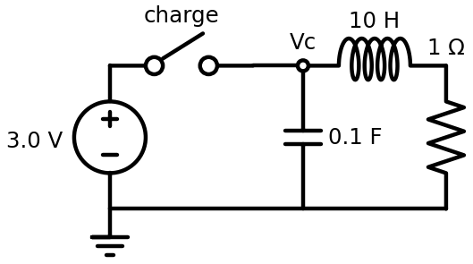
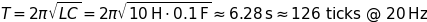

# RLC Ring-Down

## What This Shows

Capacitors and inductors can trade stored energy back and forth. The capacitor stores energy in an electric field, and the inductor stores energy in a magnetic field. A resistor removes a little energy each cycle, so the oscillation fades.

## Schematic



## What To Observe

Close the switch to charge the capacitor from the `3.0 V` source, like two AA batteries in series. Then open the switch to disconnect the source and watch the ring-down on the Industrial Data Logger outputs.

The circuit uses:

- `L = 10 H`
- `C = 0.1 F`, or `100 mF`
- `R = 1 ohm`
- `Vsource = 3.0 V`

The voltage should swing positive and negative, starting around the `3.0 V` charge level. Each cycle should be smaller than the previous one because the resistor turns some electrical energy into heat.

## Math

The ideal natural period is:



At 20 Hz, one cycle lasts about 126 simulator ticks, which is slow enough to watch.

The Falstad `O` scope outputs import as Voltage Probe plus Industrial Data Logger blocks. The importer configures the probe and logger for a symmetric voltage range, so negative and positive swings are both visible.

## Q/A

**Q: Where is the energy stored when the capacitor voltage is largest?**

A: Mostly in the capacitor's electric field. High capacitor voltage means the capacitor is strongly charged.

**Q: Where is the energy stored when the inductor current is largest?**

A: Mostly in the inductor's magnetic field. High inductor current means the magnetic field is strongest.

**Q: Why does the waveform get smaller over time?**

A: The resistor turns some electrical energy into heat each cycle, so less energy remains for the next swing.

**Q: What would happen if the resistor were larger?**

A: The oscillation would die out faster. With enough resistance, it may stop looking like a clear oscillation.

**Q: What would happen if `L` or `C` were made larger?**

A: The oscillation would get slower because the ideal period equation above depends on the square root of `L * C`. Larger `L` or `C` makes the square root larger.

**Q: Why might the capacitor value be shown as `100 mF`?**

A: `mF` means millifarads. `1000 mF = 1 F`, so `100 mF = 0.1 F`.

## Import Text

```text
$ 1 5.0E-6 10 50 5
# 20 Hz educational RLC tank:
# L = 10 H, C = 0.1 F, R = 1 ohm
# Natural period is about 6.28 s, or about 126 ticks at 20 Hz.
# Close the switch to charge the capacitor from the 3.0 V source, then open it to watch the ring-down.
v 0 192 0 128 0 0 0 3.0 0
w 0 128 64 128 0
s 64 128 128 128 0 1
w 128 128 256 128 0
l 256 128 384 128 0 10 0
r 384 128 384 192 0 1
w 384 192 256 192 0
c 256 192 256 128 0 0.1 0
w 256 192 0 192 0
g 0 192 0 192 0
O 256 128 256 64 2
O 384 128 448 128 2
```
