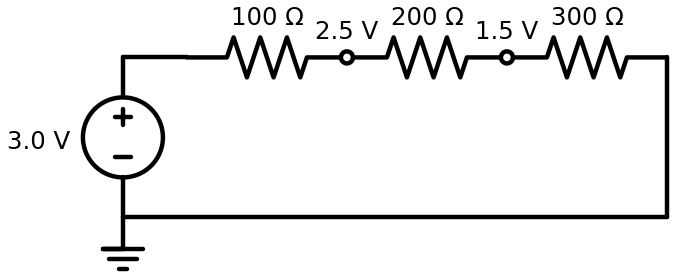
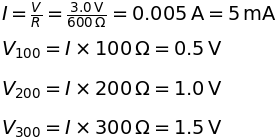
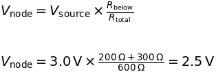

# Series Voltage Drops

## What This Shows

A series circuit has one path for current. The same current flows through every resistor, but the voltage drops are shared according to resistance. This is also a voltage divider: the resistors split the `3.0 V` source into smaller node voltages.

## Schematic



## What To Observe

The source is `3.0 V`, like two AA batteries in series. The resistors are `100 ohm`, `200 ohm`, and `300 ohm`, for a total of `600 ohm`. The whole chain draws about `0.005 A`, or `5 mA`.

Expected node voltages:

- Source node: about `3.0 V`
- Between `100 ohm` and `200 ohm`: about `2.5 V`
- Between `200 ohm` and `300 ohm`: about `1.5 V`
- Ground: `0 V`

The drops are `0.5 V`, `1.0 V`, and `1.5 V`. The largest resistor gets the largest voltage drop.

Because all three resistors are in series, adding resistance lowers the current draw. If the source voltage stays the same and total resistance goes up, current goes down.

## Math



Voltage divider form:



For the node after the first resistor, the resistance below the node is `200 ohm + 300 ohm`, so the node is about `2.5 V`.

## Q/A

**Q: Why is the current the same through every resistor?**

A: There is only one path around the loop. Charge cannot choose a different branch, so the same amount of current must pass through each part.

**Q: Why does the `300 ohm` resistor drop three times as much voltage as the `100 ohm` resistor?**

A: Voltage drop follows `V = I * R`. The current is the same everywhere, so tripling resistance triples the voltage drop.

**Q: Why is this called a voltage divider?**

A: The resistors divide the source voltage into smaller voltages at the middle nodes. Those node voltages depend on the resistance above and below the node.

**Q: What would happen if one resistor were removed and the circuit opened?**

A: Current would stop everywhere because the only path would be broken.

**Q: Why might the game show `5 mA` instead of `0.005 A`?**

A: `mA` means milliamps. `1 A = 1000 mA`, so `0.005 A = 5 mA`. The two values mean the same current.

## Import Text

```text
$ 1 5.0E-6 10 50 5
# Series resistor lesson:
# 3.0 V source through 100 ohm, 200 ohm, and 300 ohm resistors.
# Total resistance is 600 ohm, so current is 0.005 A.
v 0 192 0 128 0 0 0 3.0 0
w 0 128 64 128 0
r 64 128 128 128 0 100
r 128 128 192 128 0 200
r 192 128 256 128 0 300
w 256 128 256 192 0
w 256 192 0 192 0
g 0 192 0 192 0
O 0 128 0 64 2
O 128 128 128 64 2
O 192 128 192 64 2
```
