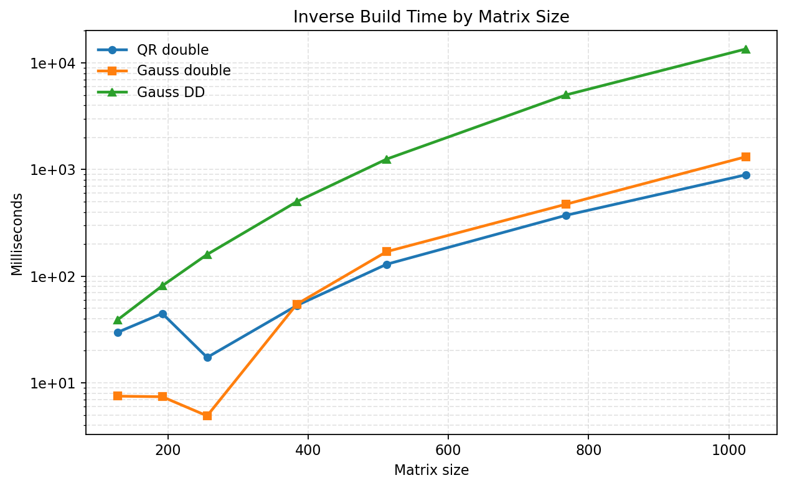
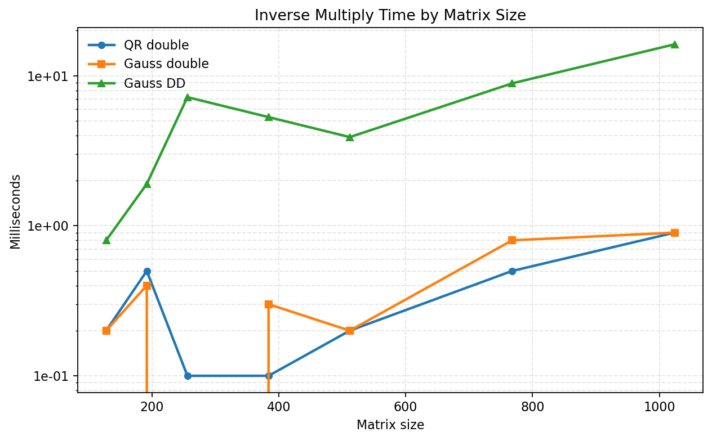
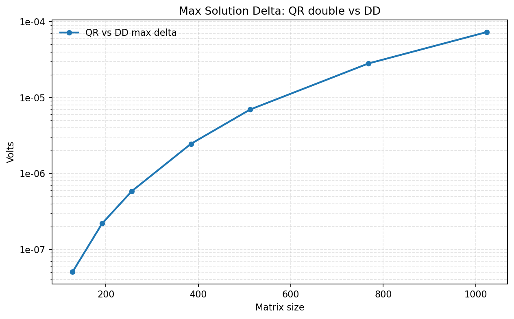
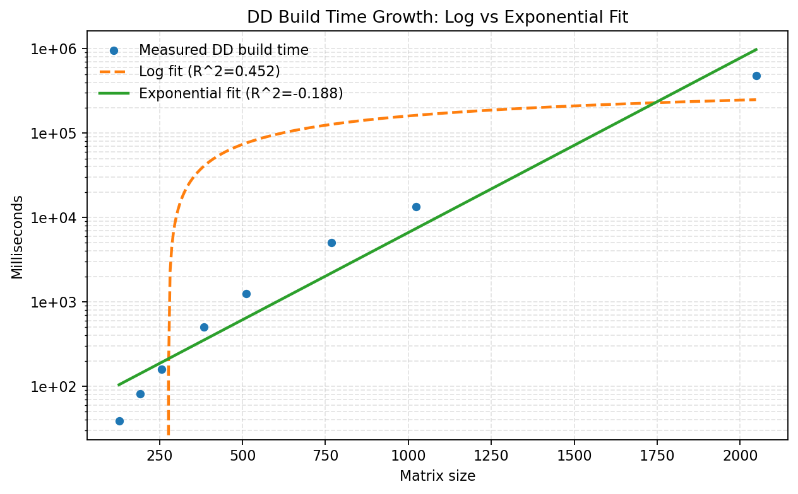
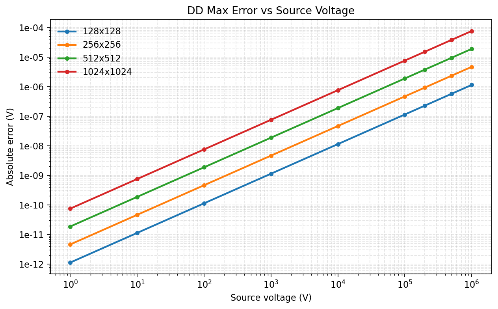
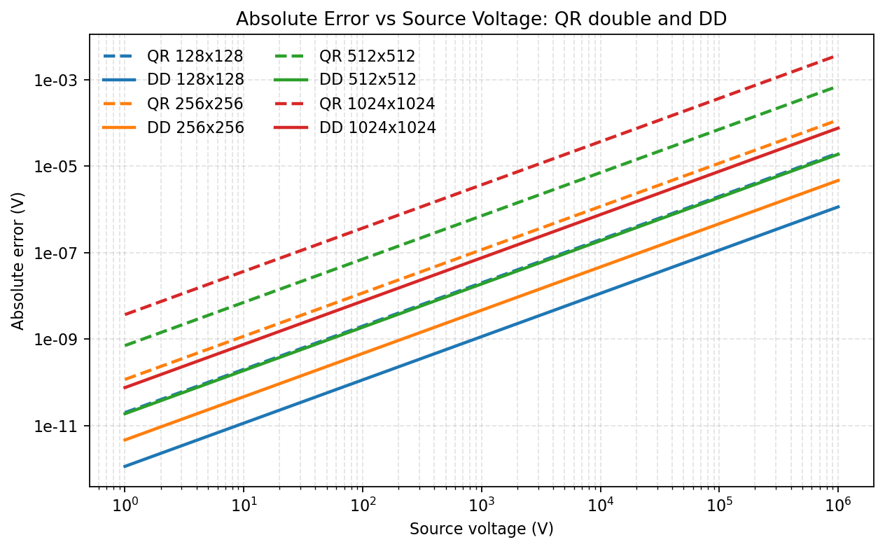
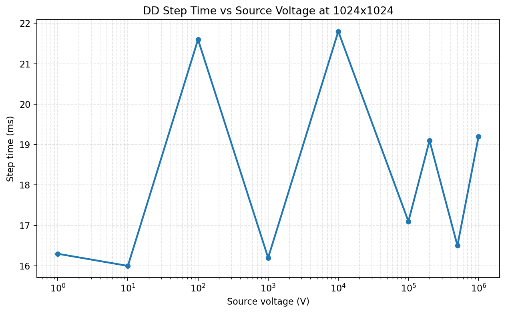

# MNA Double-Double Benchmarks

This page summarizes local benchmark results for the MNA solver after switching the solve path to Apache `DD` (`commons-numbers-core`).

The measurements below were taken on `2026-04-19` in the local development environment for this repo. They are intended to answer two questions:

1. How much slower is the `DD` path than the old `double` path?
2. Does the `DD` path stay numerically stable on large, badly conditioned resistor ladders?

## Test Setup

Comparison runs used the benchmark in [SubSystemDdBenchmarkTest.kt](/home/jared/Projects/ElectricalAge/src/test/kotlin/mods/eln/sim/mna/SubSystemDdBenchmarkTest.kt).

Common setup for the comparisons:

- Ladder network with `N - 1` voltage nodes and one voltage-source current state, for an `N x N` matrix
- `series resistance = 1.68e-7 Ω`
- `shunt resistance = 1e9 Ω`
- Fixed deterministic RHS for direct inverse-multiply comparison

The three solve variants compared were:

- `QR double`: the original Commons Math QR inverse path
- `Gauss double`: the same Gauss-Jordan inverse algorithm as the new path, but using `double`
- `Gauss DD`: the new Gauss-Jordan inverse algorithm using Apache `DD`

Large-network stability runs used the same benchmark harness plus the ladder reference solve from [SubSystemCopperPrecisionTest.kt](/home/jared/Projects/ElectricalAge/src/test/kotlin/mods/eln/sim/mna/SubSystemCopperPrecisionTest.kt).

## Double vs DD Comparison

### Raw Results

| Matrix size | QR build ms | Gauss double build ms | DD build ms | QR solve ms | Gauss double solve ms | DD solve ms | DD vs QR build | DD vs QR solve | DD vs Gauss double build | DD vs Gauss double solve | QR vs DD max delta | Gauss double vs DD max delta |
| --- | ---: | ---: | ---: | ---: | ---: | ---: | ---: | ---: | ---: | ---: | ---: | ---: |
| 128 | 29.7 | 7.5 | 38.8 | 0.2 | 0.2 | 0.8 | 1.31x | 3.59x | 5.17x | 3.72x | 5.060e-08 | 5.457e-12 |
| 192 | 44.7 | 7.4 | 81.2 | 0.5 | 0.4 | 1.9 | 1.82x | 3.47x | 10.94x | 4.43x | 2.199e-07 | 8.185e-12 |
| 256 | 17.3 | 4.9 | 159.8 | 0.1 | 0.0 | 7.2 | 9.23x | 70.41x | 32.34x | 144.02x | 5.844e-07 | 9.095e-12 |
| 384 | 53.1 | 54.7 | 500.0 | 0.1 | 0.3 | 5.3 | 9.41x | 52.04x | 9.15x | 16.79x | 2.459e-06 | 3.092e-11 |
| 512 | 129.3 | 169.8 | 1252.1 | 0.2 | 0.2 | 3.9 | 9.68x | 21.15x | 7.38x | 18.82x | 6.961e-06 | 3.456e-11 |
| 768 | 372.2 | 473.0 | 5008.4 | 0.5 | 0.8 | 8.9 | 13.46x | 19.15x | 10.59x | 11.64x | 2.818e-05 | 1.201e-10 |
| 1024 | 890.8 | 1315.2 | 13476.2 | 0.9 | 0.9 | 16.2 | 15.13x | 18.26x | 10.25x | 18.26x | 7.304e-05 | 1.637e-10 |

### Build Time

### Solve Time

### QR Drift vs DD

The denser size series makes the trend clearer:

- `DD` build time grows much faster than the QR baseline
- By `1024`, `DD` build time is about `15.13x` slower than QR and about `10.25x` slower than Gauss-Jordan in plain `double`
- QR-vs-DD solution drift also grows with matrix size on this ill-conditioned ladder

## DD Large-Network Stability

The most useful stress cases found in the sweeps were:

- Moderate copper-like case: `series = 1.68e-3 Ω`
- Worst observed conditioning in the `1024` sweep: `series = 1.68e-7 Ω`
- Extreme low series resistance: `series = 1.68e-10 Ω`

### 1024 Sweep

| Matrix size | Series resistance | Condition ratio (`shunt / series`) | DD build ms | DD step ms | Max error vs BigDecimal |
| --- | ---: | ---: | ---: | ---: | ---: |
| 1024 | 1.68e-3 | 5.952e11 | 11587.6 | 24.2 | 1.115e-09 |
| 1024 | 1.68e-4 | 5.952e12 | 11855.5 | 16.9 | 4.681e-09 |
| 1024 | 1.68e-5 | 5.952e13 | 11186.0 | 15.4 | 4.287e-09 |
| 1024 | 1.68e-6 | 5.952e14 | 11335.5 | 15.1 | 7.214e-09 |
| 1024 | 1.68e-7 | 5.952e15 | 11187.9 | 26.0 | 9.072e-09 |
| 1024 | 1.68e-8 | 5.952e16 | 10880.8 | 14.9 | 1.054e-09 |
| 1024 | 1.68e-9 | 5.952e17 | 10524.0 | 15.0 | 1.054e-10 |
| 1024 | 1.68e-10 | 5.952e18 | 11206.3 | 15.0 | 1.054e-11 |

The worst observed error in this sweep was the `1.68e-7 Ω` case, but even there the DD path stayed within `9.072e-09 V` of the `BigDecimal` reference.

### 2048 Sweep

| Matrix size | Series resistance | Condition ratio | DD build ms | DD step ms | Max error vs BigDecimal |
| --- | ---: | ---: | ---: | ---: | ---: |
| 2048 | 1.68e-3 | 5.952e11 | 370902.0 | 77.1 | 4.465e-09 |
| 2048 | 1.68e-7 | 5.952e15 | 483498.5 | 196.7 | 3.638e-08 |
| 2048 | 1.68e-10 | 5.952e18 | 490563.8 | 179.5 | 4.222e-11 |

### DD Scaling Fit

I replaced the old scaling-fit chart with a fresh log-vs-exponential version against the measured DD build-time series.

- Log fit in value-space: `R² ≈ 0.452`
- Exponential fit in value-space: `R² ≈ -0.188`
- Log fit in log-space: `R² ≈ -45.239`
- Exponential fit in log-space: `R² ≈ 0.950`

Measured fit formulas:

- Log fit: `y = -698697.793 + 124248.698 * ln(x)`
- Exponential fit: `y = 5.668744e+01 * exp(4.761367e-03 * x)`

Interpretation:

- A pure logarithmic model is a poor fit.
- A simple exponential model is not good in raw value-space, but it matches the log-scale trend of the measured points much better.
- On the plotted data, the DD build-time curve behaves more like an exponential rise than a logarithmic one.

## Voltage Sweep

To test source magnitude sensitivity, the DD solver was run at:

- `1 V`
- `10 V`
- `100 V`
- `1 kV`
- `10 kV`
- `100 kV`
- `200 kV`
- `500 kV`
- `1 MV`

The voltage sweep used:

- sizes `128, 192, 256, 384, 512, 768, 1024`
- `series resistance = 1.68e-7 Ω`
- `shunt resistance = 1e9 Ω`

### 1024 Voltage Sweep

| Source voltage | Build ms | Step ms | Max error vs BigDecimal |
| ---: | ---: | ---: | ---: |
| 1 | 13487.2 | 16.3 | 7.560e-11 |
| 10 | 13487.2 | 16.0 | 7.560e-10 |
| 100 | 13487.2 | 21.6 | 7.560e-09 |
| 1000 | 13487.2 | 16.2 | 7.560e-08 |
| 10000 | 13487.2 | 21.8 | 7.560e-07 |
| 100000 | 13487.2 | 17.1 | 7.560e-06 |
| 200000 | 13487.2 | 19.1 | 1.512e-05 |
| 500000 | 13487.2 | 16.5 | 3.780e-05 |
| 1000000 | 13487.2 | 19.2 | 7.560e-05 |

### Voltage Error

### Voltage Error: QR Double vs DD

Dashed lines are the original QR `double` solver. Solid lines are the DD solver.

### 1024 Step Time vs Voltage

The voltage sweep shows:

- Build time is effectively independent of voltage, as expected
- Step time varies only slightly with voltage
- Absolute error scales roughly linearly with source voltage on this linear circuit

## 4096 Outcome

Attempted case:

- `matrix size = 4096`
- `series = 1.68e-7 Ω`
- `shunt = 1e9 Ω`

Observed result:

- The run failed with `OutOfMemoryError`
- The failure occurred inside `subSystem.generateMatrix()`
- The failure point was the DD inverse build, not the `BigDecimal` reference solve

## Conclusions

- The DD path materially improves robustness on ill-conditioned networks.
- The QR `double` path diverges noticeably from DD on the `1024` worst-case comparison point, with about `7.304e-05 V` max delta.
- The same Gauss-Jordan algorithm in plain `double` stays very close to DD on the same benchmark, which means the largest observed performance penalty is coming from `DD` arithmetic rather than only from the change in inversion algorithm.
- Voltage magnitude does not materially change runtime on this linear setup, but it scales the absolute error almost linearly.
- The current DD implementation is not viable for very large dense systems because it still computes and stores a full inverse.
- `2048 x 2048` is numerically fine but operationally very slow.
- `4096 x 4096` does not fit within the current test-worker heap and fails during inverse construction.

## Rule of Thumb for Sub-100x100 Matrices

Using the conservative `128 x 128` worst-case ladder as a proxy for sub-`100 x 100` matrices:

- To keep absolute error under `1 µV`
- Regular QR `double` is good up to about `50.0 kV`
- DD is good up to about `877.2 kV`

Practical reading:

- Below `50 kV`, regular `double` is usually the better default
- From `50 kV` up to about `877 kV`, DD gives useful extra margin
- Above about `877 kV`, even DD can exceed `1 µV` absolute error on similarly bad cases

## Recommended Next Step

If `4096`-class systems need to be practical, the next solver change should be:

- Replace explicit inverse construction with a DD factorization/solve path, likely DD LU with partial pivoting

That would preserve most of the numerical benefit while cutting both memory usage and build time substantially.
